#  P 2.2: Evaluación de IDEs

**Autor:** Cristian Carrasco Jiménez  
**Curso:** 1º DAW A  

---

## 📑 Índice
1. [Instalación de entornos de desarrollo](#1-instalación-de-entornos-de-desarrollo)  
2. [Gestión de módulos y extensiones](#2-gestión-de-módulos-y-extensiones)  
3. [Personalización y automatización del entorno](#3-personalización-y-automatización-del-entorno)  
4. [Configuración del sistema de actualización](#4-configuración-del-sistema-de-actualización)  
5. [Generación de ejecutables a partir de código fuente en distintos lenguajes](#5-generación-de-ejecutables-a-partir-de-código-fuente-en-distintos-lenguajes)  
6. [Generación de ejecutables con diferentes IDEs](#6-generación-de-ejecutables-con-diferentes-ides)  
7. [Conclusión](#conclusión)

---

## 1️⃣ Instalación de entornos de desarrollo

**IDE 1:** PyCharm Professional *(propietario)*  
**IDE 2:** Thonny *(libre)*  

###  Diferencias en el proceso de instalación

**PyCharm Professional:**
- Requiere crear una cuenta en JetBrains o activar una licencia de prueba.  
- Instalador más grande y más lento.  
- Permite elegir complementos, versión de Python y opciones de integración.

**Thonny:**
- Instalación ligera (incluso versión portable).  
- No requiere cuenta ni licencia.  
- Se instala en pocos clics sin configuraciones avanzadas.

###  Ventajas durante la instalación
- **PyCharm:** interfaz profesional, configuración avanzada, integración con Git y Docker.
  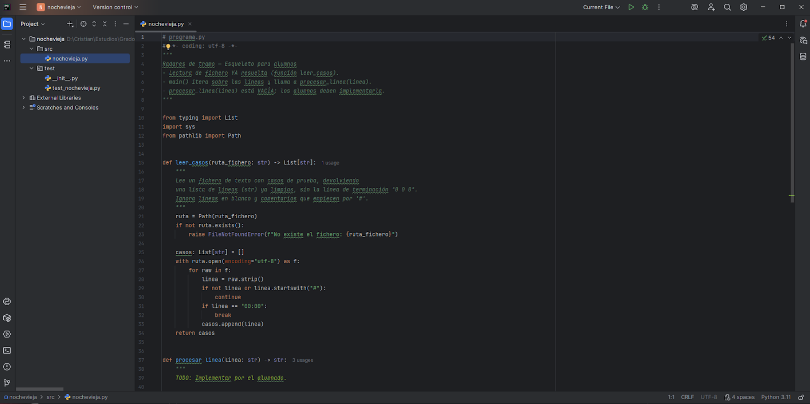
  
- **Thonny:** rapidez, simplicidad y facilidad para principiantes.
  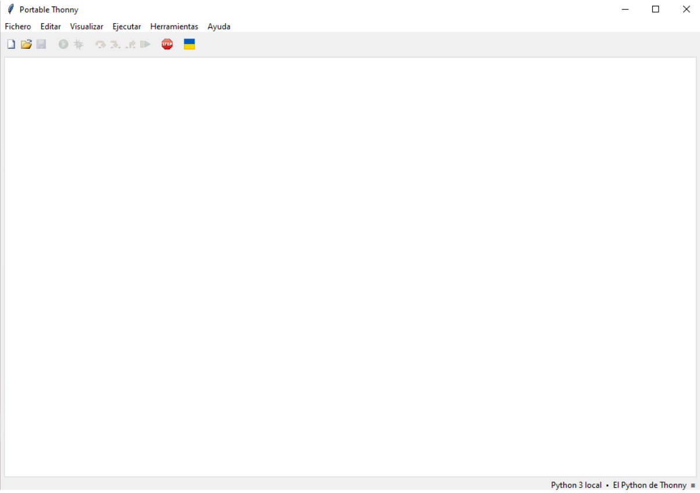

---

## 2️⃣ Gestión de módulos y extensiones

###  Extensiones añadidas
- **PyCharm:** plugin de Python (ya incluido).  
- **Thonny:** paquete `pygame` desde su gestor de paquetes.

###  Proceso de instalación
- **PyCharm:** `File → Settings → Plugins → Marketplace → Instalar`.  
- **Thonny:** `Herramientas → Gestionar paquetes → Escribir módulo → Instalar`.

###  Beneficios
- **PyCharm:** los plugins mejoran la productividad y la vista del código.
  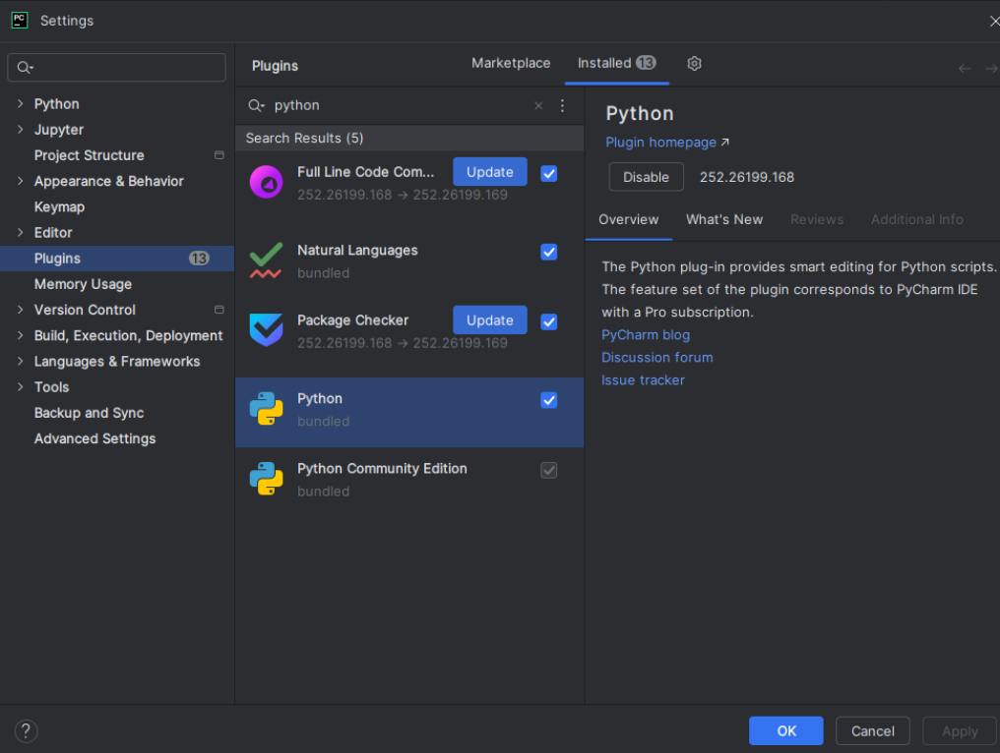
  
- **Thonny:** permite ampliar capacidades fácilmente (por ejemplo, crear juegos con *pygame*).
  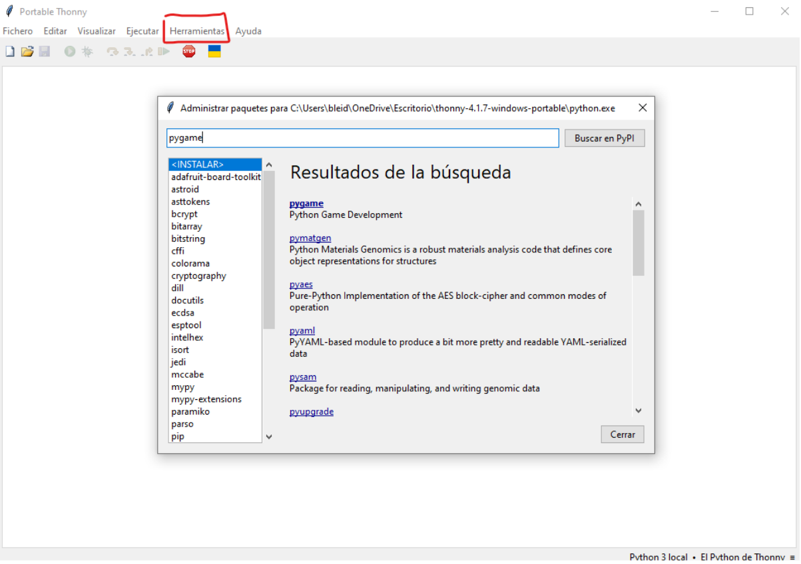

---

## 3️⃣ Personalización y automatización del entorno

###  Personalización
- **PyCharm:** tema *Dark*, atajos personalizados para ejecutar código más rápido.
  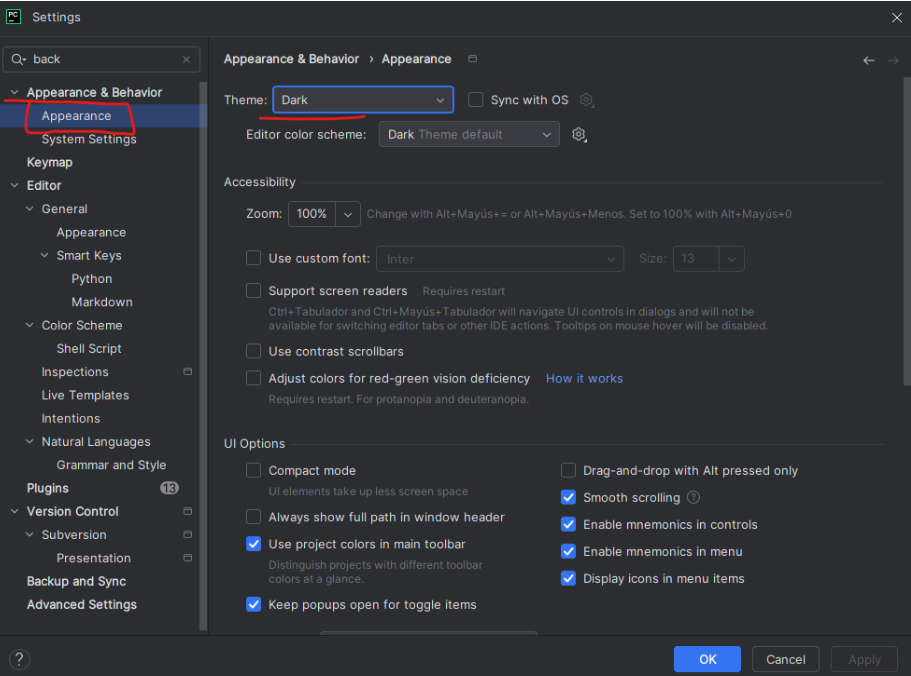
  
- **Thonny:** modo oscuro, aumento del tamaño de fuente y números de línea visibles.
  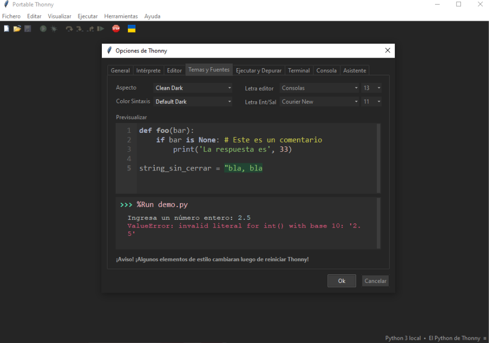

###  Beneficios
- **PyCharm:** gran cantidad de atajos configurables para casi todo.
  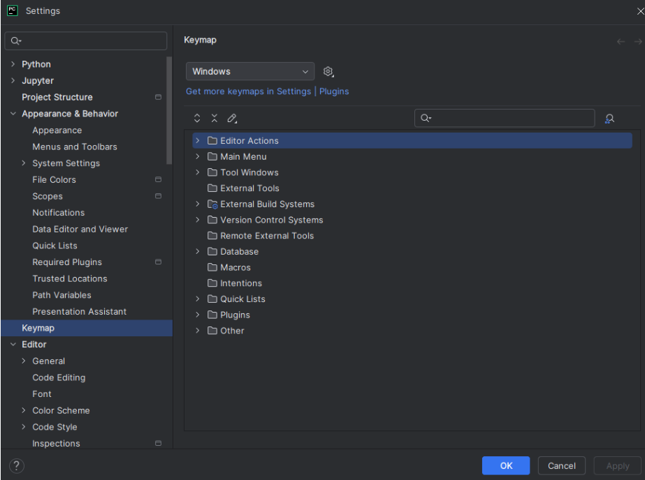
  
- **Thonny:** atajos básicos, ideal para tareas simples (por ejemplo, `F5` para ejecutar).
  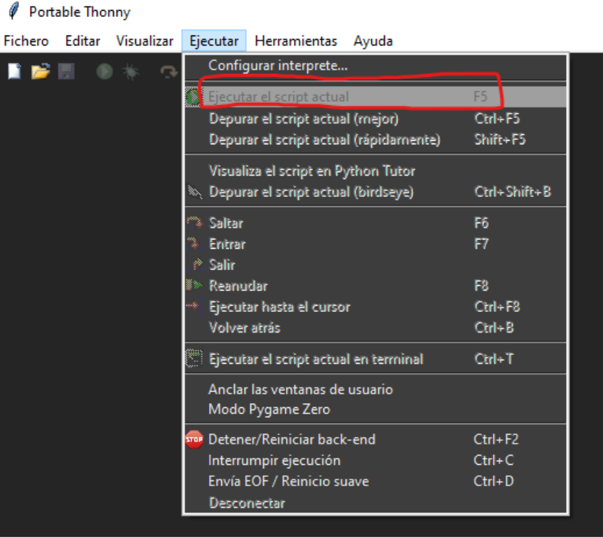

---

## 4️⃣ Configuración del sistema de actualización

###  Configuración aplicada
- **PyCharm:** `File → Settings → Appearance & Behavior → System Settings → Updates`, con actualizaciones automáticas activadas.
  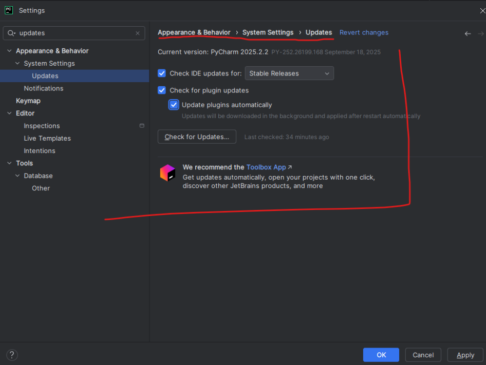
  
- **Thonny:** requiere descargar manualmente la versión más reciente desde su web e instalarla.
  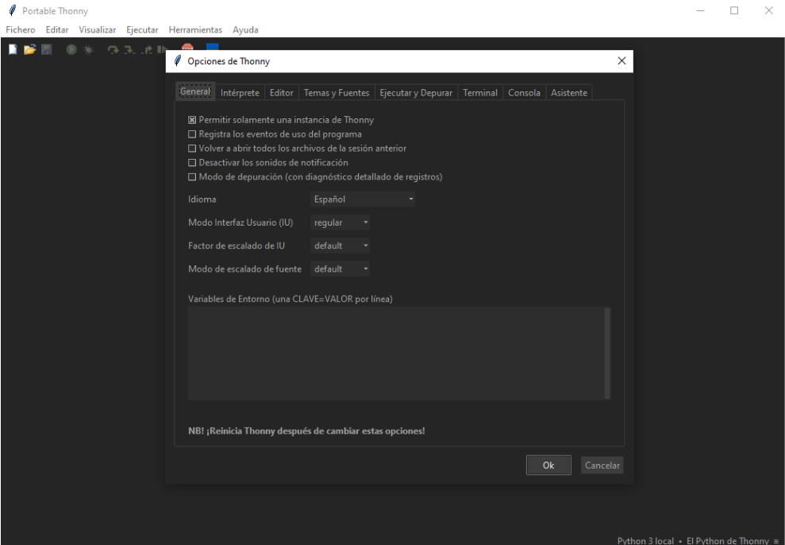

###  Importancia
Mantener los IDEs actualizados asegura compatibilidad con nuevas versiones de Python, corrige errores y mejora la seguridad.

---

## 5️⃣ Generación de ejecutables a partir de código fuente en distintos lenguajes

> ⚠️ PyCharm y Thonny son IDEs enfocados en **Python**, por lo que no permiten ejecutar varios lenguajes directamente.  
> Se usaron **Visual Studio Code** e **IntelliJ IDEA** como referencia.

### 💻 Ejemplo de programa

**Python:**
```python
for i in range(10, -1, -1):
    print(i)
print("¡Despegue!")
```

**Java:**
```java
public class Despegue {
    public static void main(String[] args) {
        for (int i = 10; i >= 0; i--) {
            System.out.println(i);
        }
        System.out.println("¡Despegue!");
    }
}
```

###  Proceso en diferentes IDEs

- **Visual Studio Code:**  
  Instalar extensiones de cada lenguaje (Python, Java), abrir cada archivo y ejecutar.  
  Detecta automáticamente el lenguaje y usa el intérprete o compilador adecuado.

- **IntelliJ IDEA:**  
  Crear módulos por lenguaje dentro del mismo proyecto.  
  El IDE compila o interpreta según la configuración del módulo.

###  Diferencias en la generación del ejecutable
- **Python:** se ejecuta directamente (lenguaje interpretado).  
- **Java:** compila primero a bytecode `.class` (lenguaje compilado).  

>  Los lenguajes interpretados como Python permiten iterar más rápido, mientras que los compilados como Java requieren más pasos pero ofrecen mejor rendimiento.
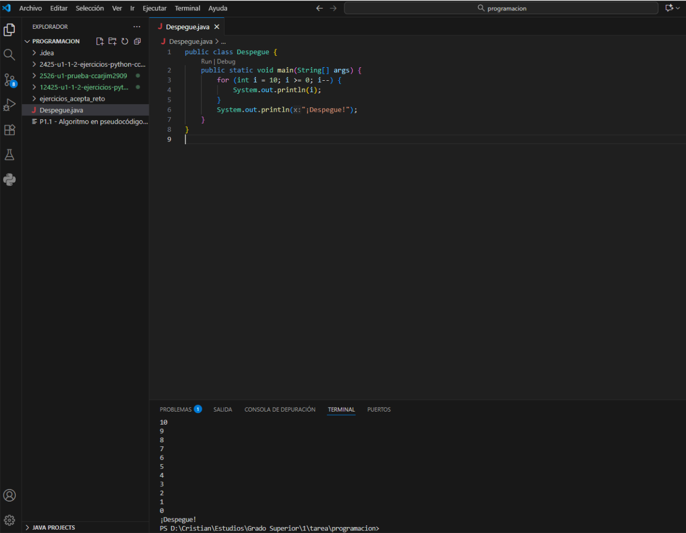


---

## 6️⃣ Generación de ejecutables con diferentes IDEs

###  Código Python ejecutado en ambos IDEs
```python
for i in range(10, -1, -1):
    print(i)
print("¡Despegue!")
```

###  Diferencias observadas
- **PyCharm:** gestión avanzada de carpetas, consola profesional, mensajes de error detallados.
  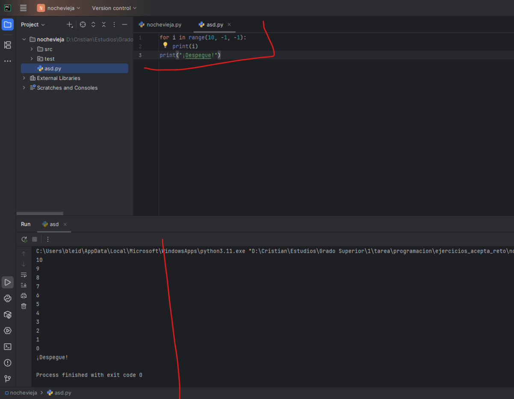
- **Thonny:** interfaz limpia, intuitiva y excelente para principiantes.
  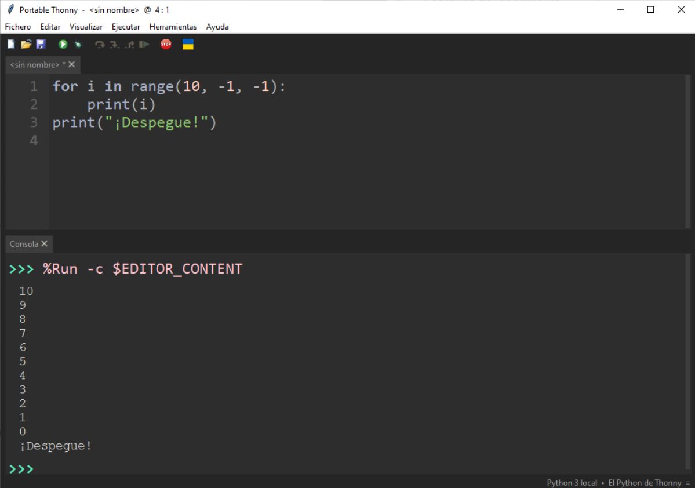

---

##  Conclusión

💬 Me resultó más cómodo trabajar con **PyCharm** por su accesibilidad y herramientas integradas,  
aunque **Thonny** es una excelente opción para aprender y crear scripts simples.

---


