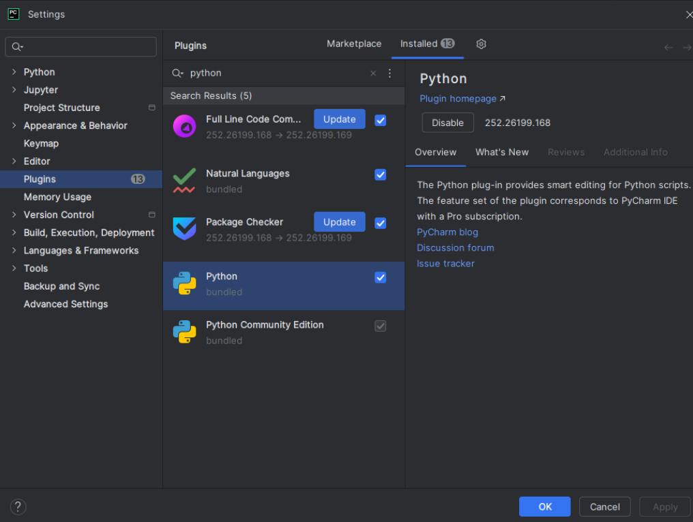
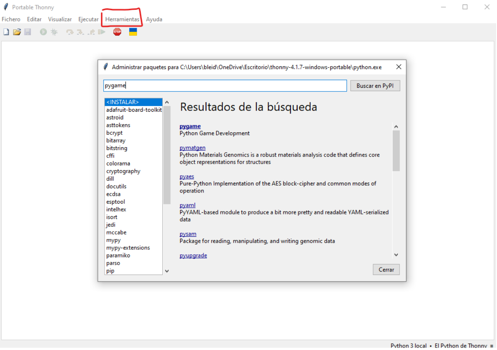

# Punto 2.2: Gestión de módulos y extensiones

## IDEs utilizados
- *IDE 1:* PyCharm Professional (versión más reciente)  
- *IDE 2:* Thonny (versión más reciente)

## Descripción de la tarea
Agregar extensiones o módulos que amplíen la funcionalidad de cada IDE, por ejemplo, un plugin para Python en PyCharm o un paquete como `pygame` en Thonny.

## Respuestas a preguntas evaluativas
### Pregunta 1: ¿Cómo fue el proceso de instalación de extensiones o módulos en cada IDE?
- **PyCharm:** `File → Settings → Plugins → Marketplace → Instalar`.  
- **Thonny:** `Herramientas → Gestionar paquetes → Escribir módulo → Instalar`.

### Pregunta 2: ¿Qué beneficios proporcionan las extensiones o plugins que instalaste para el desarrollo de tus proyectos?
- **PyCharm:** mejoran la productividad y la visualización del código.  
- **Thonny:** permite ampliar las capacidades del IDE, por ejemplo, para crear juegos con `pygame`.

## Evidencias
  

## Observaciones
Los plugins/extensiones son esenciales para personalizar y optimizar el entorno de desarrollo según el proyecto.
