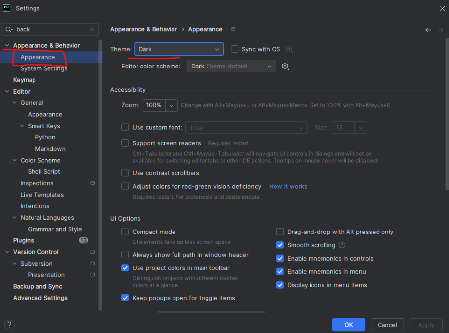
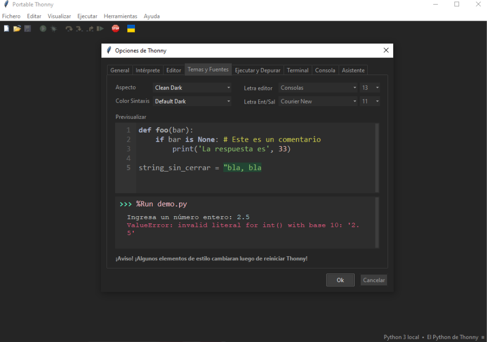
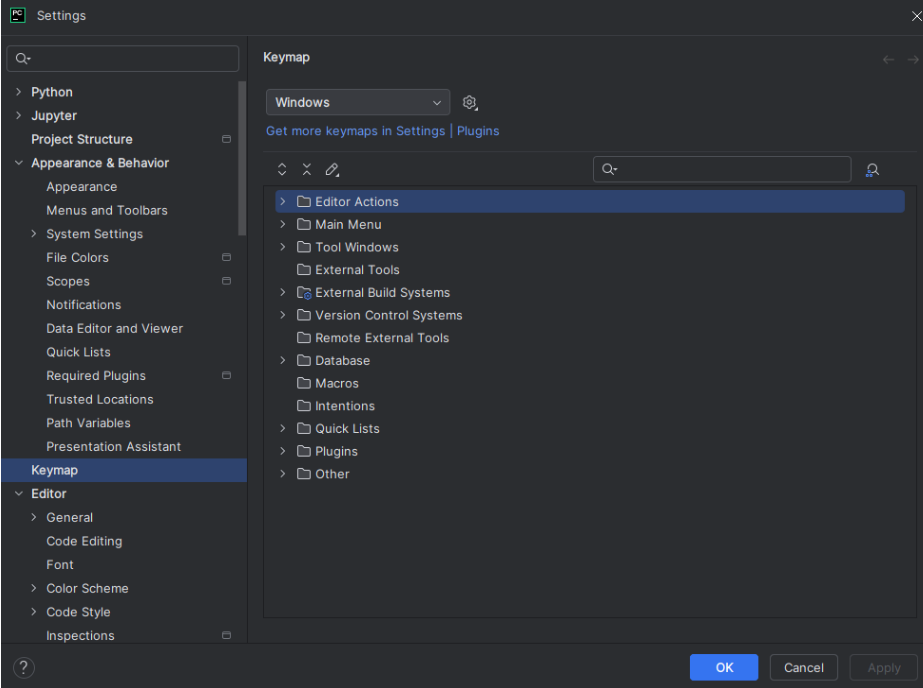
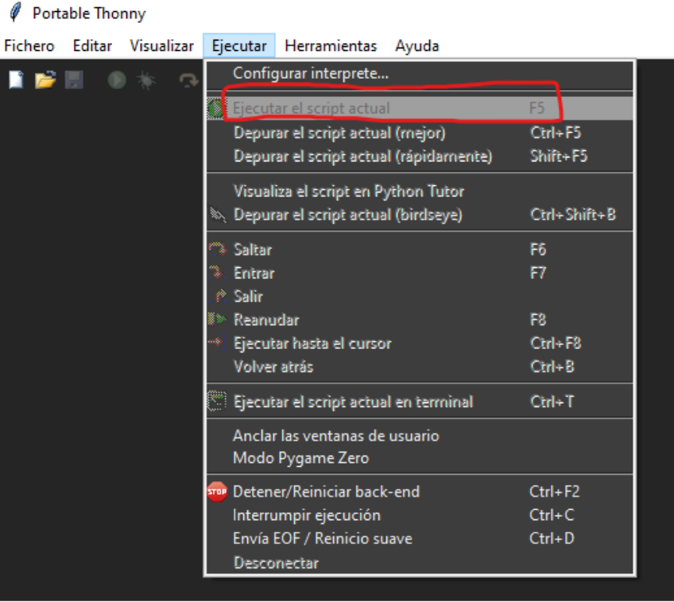

# Punto 2.3: Personalización y automatización del entorno

## IDEs utilizados
- *IDE 1:* PyCharm Professional (versión más reciente)  
- *IDE 2:* Thonny (versión más reciente)

## Descripción de la tarea
Personalizar el entorno de cada IDE (tema, atajos de teclado) y automatizar tareas como la ejecución de pruebas o compilación de código.

## Respuestas a preguntas evaluativas
### Pregunta 1: ¿Qué aspectos del entorno personalizaste y cómo mejoró tu experiencia de desarrollo?
- **PyCharm:** tema oscuro y atajos personalizados para ejecutar código más rápido.  
- **Thonny:** modo oscuro, aumento del tamaño de fuente y números de línea visibles.

### Pregunta 2: ¿Cómo configuraste la automatización de tareas y en qué te benefició durante el trabajo?
- **PyCharm:** atajos configurables para ejecutar tareas repetitivas de manera rápida.  
- **Thonny:** atajos básicos como `F5` para ejecutar, simplificando tareas simples.

## Evidencias
  

  

  

## Observaciones
La personalización facilita la productividad y mejora la experiencia del usuario según el nivel de complejidad del proyecto.
