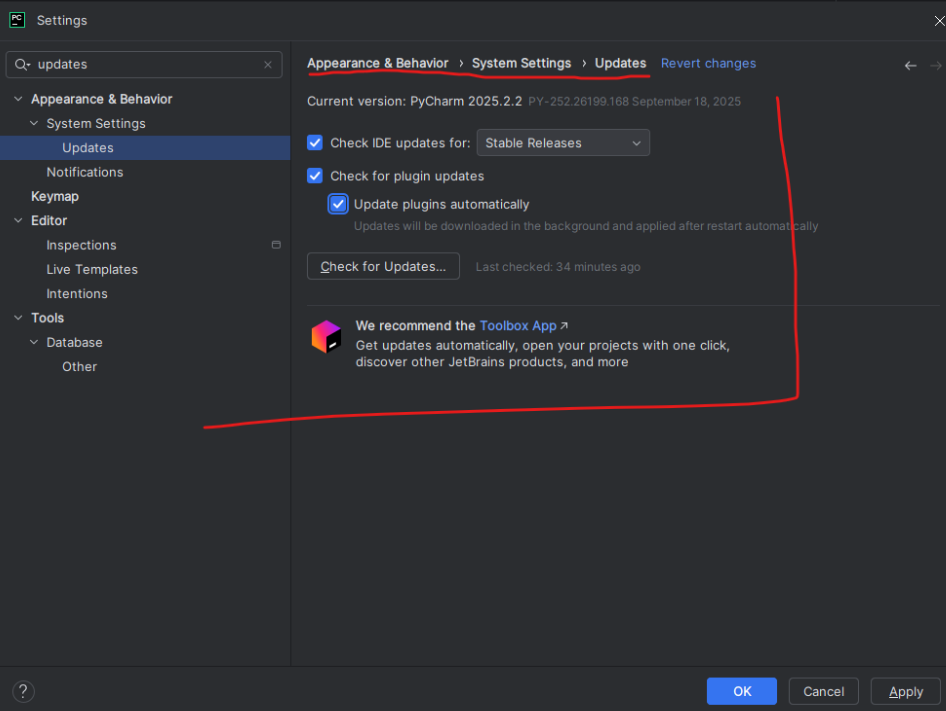
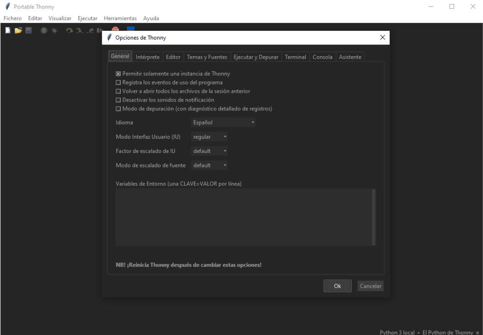

# Punto 2.4: Configuración del sistema de actualización del entorno de desarrollo

## IDEs utilizados
- *IDE 1:* PyCharm Professional (versión más reciente)  
- *IDE 2:* Thonny (versión más reciente)

## Descripción de la tarea
Configurar las actualizaciones automáticas o manuales para asegurar que los IDEs estén al día con las últimas versiones y mejoras.

## Respuestas a preguntas evaluativas
### Pregunta 1: ¿Cómo configuraste las actualizaciones automáticas en cada IDE?
- **PyCharm:** `File → Settings → Appearance & Behavior → System Settings → Updates`, con actualizaciones automáticas activadas.  
- **Thonny:** actualización manual descargando la versión más reciente desde la web.

### Pregunta 2: ¿Por qué es importante mantener el IDE actualizado en proyectos de desarrollo?
- Mantener los IDEs actualizados asegura compatibilidad con nuevas versiones de Python, corrige errores y mejora la seguridad.

## Evidencias
  

## Observaciones
La actualización regular previene problemas de compatibilidad y mejora la experiencia de desarrollo.
