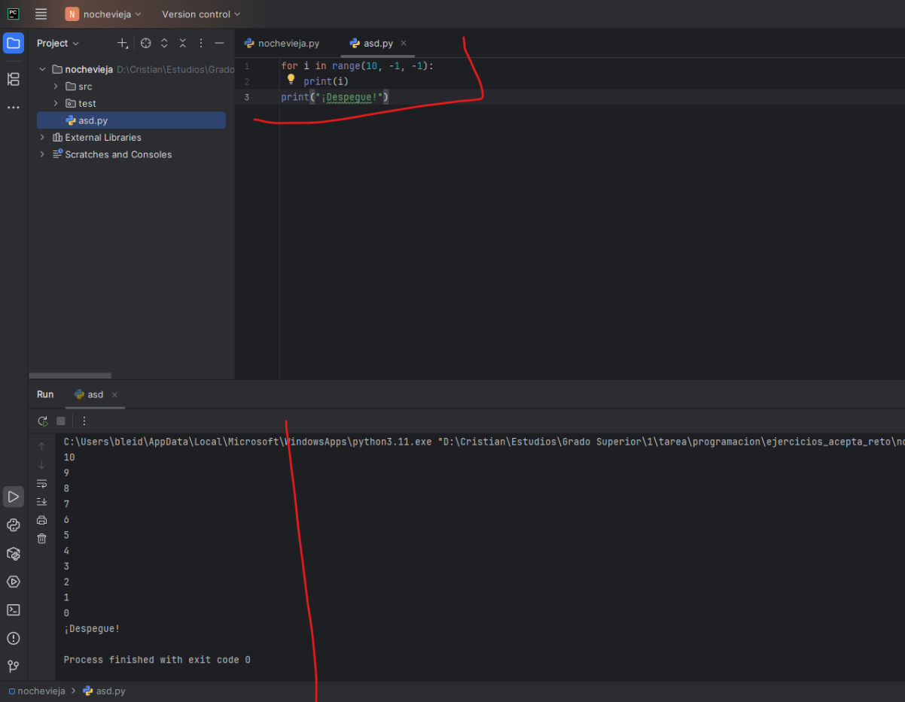
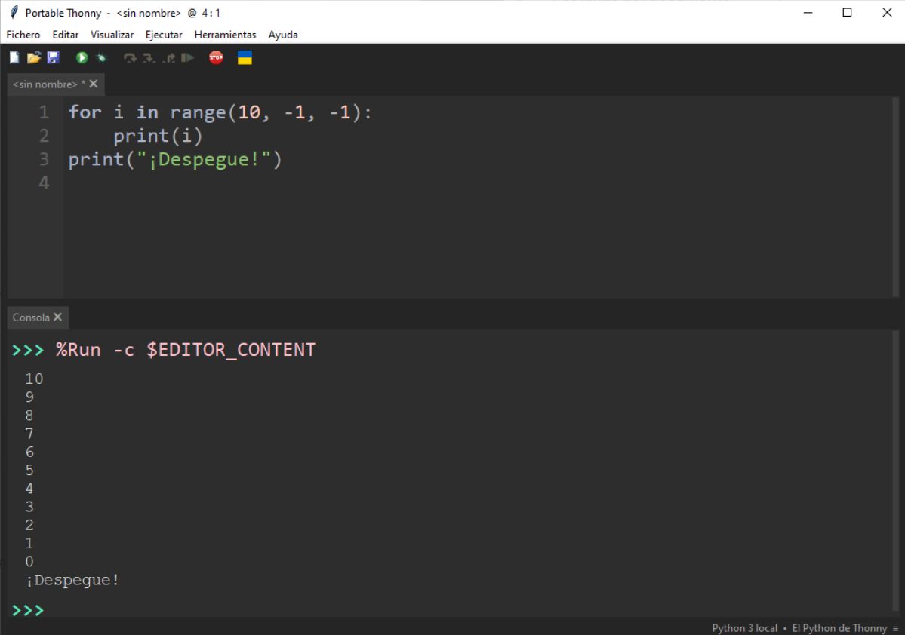

# Punto 2.6: Generación de ejecutables con diferentes IDEs a partir del mismo código fuente

## IDEs utilizados
- *IDE 1:* PyCharm Professional (versión más reciente)  
- *IDE 2:* Thonny (versión más reciente)

## Descripción de la tarea
Escribir un programa en Python que cuente de 10 a 0 y luego imprima "¡Despegue!" y ejecutarlo en los IDEs seleccionados.

## Respuestas a preguntas evaluativas
### Pregunta 1: ¿Qué diferencias encontraste al ejecutar el mismo código fuente en diferentes IDEs?
- **PyCharm:** gestión avanzada de carpetas, consola profesional, mensajes de error detallados.  
- **Thonny:** interfaz limpia, intuitiva y excelente para principiantes.

### Pregunta 2: ¿Cuál de los IDEs te pareció más cómodo o eficiente para ejecutar el código Python o el lenguaje que hayas elegido? ¿Por qué?
- **PyCharm:** más cómodo por su accesibilidad y herramientas integradas.  
- **Thonny:** excelente para aprender y crear scripts simples.

## Evidencias
  

## Observaciones
PyCharm es ideal para proyectos complejos y profesionales, mientras que Thonny es excelente para aprendizaje y tareas sencillas.
